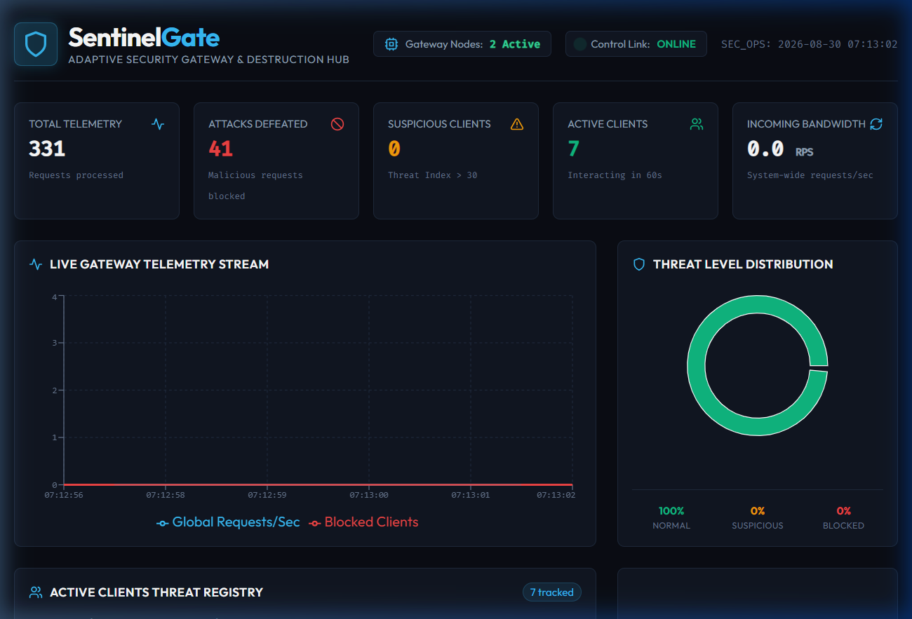
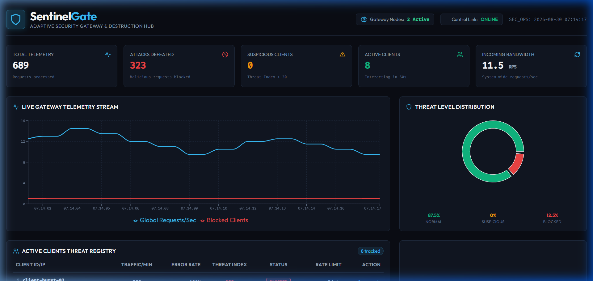
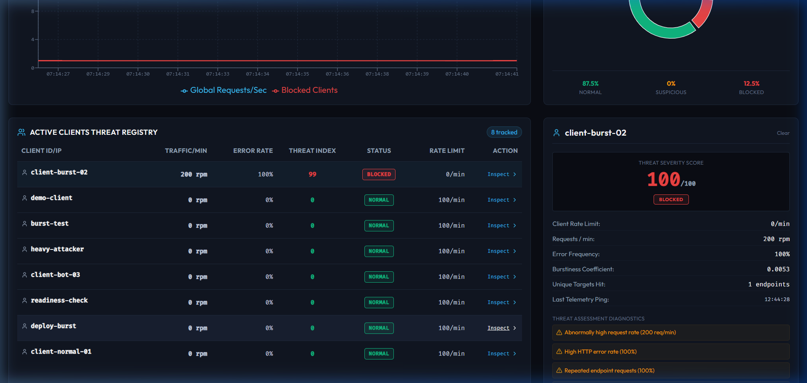

<p align="center">
  
  
  
  
  
  
</p>

<h1 align="center">🛡️ SentinelGate</h1>

<p align="center">
  <b>Adaptive Rate-Limiting & Abuse Detection API Gateway</b>
  <br/>
  <i>Intelligent API protection that learns, adapts, and recovers — powered by behavioral analytics and machine learning.</i>
</p>

<p align="center">
  
  
  
</p>

---

## 📸 Screenshots

### Dashboard — Idle State
> Clean cybersecurity-themed command center with real-time monitoring panels



### Dashboard — Under Attack
> Live telemetry during a burst attack simulation showing threat escalation, client blocking, and traffic metrics



### Client Threat Diagnostics
> Deep inspection panel showing per-client behavioral analysis, threat score breakdown, and manual override controls



---

## 🔍 The Problem

APIs are frequently abused by bots, scrapers, brute-force clients, and automated traffic. **Static rate limits** either:
- ❌ Block legitimate users during traffic bursts
- ❌ Fail to detect sophisticated, low-and-slow attacks
- ❌ Apply one-size-fits-all thresholds that don't adapt

**There is no single fixed threshold that works for all clients.**

## 💡 The Solution

SentinelGate is an **intelligent API gateway** that dynamically adjusts rate limits per client based on **behavioral patterns** rather than fixed thresholds.

It combines **deterministic rule-based heuristics** with **machine learning anomaly detection** (Isolation Forest) to create an explainable, adaptive defense layer that:

- ✅ Allows legitimate bursty traffic
- ✅ Progressively throttles suspicious behavior
- ✅ Blocks confirmed abuse patterns
- ✅ Automatically recovers when behavior normalizes

---

## ✨ Key Features

| Feature | Description |
|---------|-------------|
| 🎯 **Adaptive Rate Limiting** | Dynamic token bucket capacity based on real-time risk scores |
| 🪣 **Token Bucket Algorithm** | Redis-backed with Lua scripting for atomic, distributed operations |
| 🧠 **Isolation Forest ML** | Unsupervised anomaly detection trained on behavioral patterns |
| 📊 **Explainable Risk Scoring** | 0–100 scores with human-readable reasons for every decision |
| 🔄 **Automatic Recovery** | Risk decay mechanism prevents permanent blocking |
| 📡 **Real-Time Dashboard** | Cybersecurity-themed React dashboard with live WebSocket updates |
| ⚔️ **Attack Simulator** | Built-in traffic generator (Normal, Burst, Bot, Brute Force, DDoS) |
| 🐳 **Docker Ready** | Full Docker Compose setup with multi-instance gateway support |
| 🔗 **Distributed State** | Redis-shared rate limits enforced across multiple gateway instances |

---

## 🏗️ Architecture

```
                    ┌─────────────────────┐
                    │     API Client      │
                    └──────────┬──────────┘
                               │
                    ┌──────────▼──────────┐
                    │    SentinelGate     │
                    │     API Gateway     │
                    │  (FastAPI/Uvicorn)  │
                    └──────────┬──────────┘
                               │
          ┌────────────────────┼────────────────────┐
          │                    │                    │
          ▼                    ▼                    ▼
  ┌───────────────┐   ┌───────────────┐   ┌───────────────┐
  │ Token Bucket  │   │  Behavioral   │   │   Request     │
  │ Rate Limiter  │   │  Risk Engine  │   │    Logger     │
  │   (Redis)     │   │ (ML + Rules)  │   │ (PostgreSQL)  │
  └───────┬───────┘   └───────┬───────┘   └───────────────┘
          │                    │
          └────────┬───────────┘
                   ▼
           Decision Engine
                   │
       ┌───────────┼───────────┐
       ▼           ▼           ▼
    ALLOW       THROTTLE     BLOCK
    (200)        (429)       (403)
```

---

## 🔬 How It Works

### Request Lifecycle

```
1. Client sends request → /gateway/{path}
2. Client identified (API key / IP address)
3. Behavioral features extracted from Redis rolling window
4. Risk engine scores: heuristics + Isolation Forest anomaly
5. Adaptive rate limit assigned based on risk tier
6. Token bucket checked atomically (Redis Lua / in-memory)
7. Decision: ALLOW (200) | THROTTLE (429) | BLOCK (403)
8. Logged to DB → Broadcast to Dashboard via WebSocket
```

### Risk Tiers & Adaptive Limits

| Risk Score | Status | Rate Limit | Action |
|:----------:|:------:|:----------:|:------:|
| `0 – 30` | 🟢 NORMAL | 100 req/min | Full access |
| `31 – 60` | 🟡 MONITORED | 60 req/min | Under observation |
| `61 – 80` | 🟠 THROTTLED | 30 req/min | Reduced capacity |
| `81 – 95` | 🔴 THROTTLED | 10 req/min | Severely limited |
| `96 – 100` | ⛔ BLOCKED | 0 req/min | Access denied |

### Behavioral Risk Factors

| Factor | Weight | What It Detects |
|--------|:------:|-----------------|
| Request Rate (RPM) | 30% | High-frequency traffic |
| Burstiness | 15% | Variance in request intervals |
| Error Rate | 20% | High 4xx/5xx ratio (brute force) |
| Endpoint Repetition | 15% | Scraping same endpoint repeatedly |
| Traffic Spike Ratio | 10% | Sudden deviation from baseline |
| ML Anomaly Score | 10% | Isolation Forest outlier detection |

### Recovery Mechanism

Risk decays at **~2 points/second** when suspicious behavior stops:
```
Risk 96 (BLOCKED) → 10s pause → Risk 76 (THROTTLED) → 20s pause → Risk 36 (MONITORED) → Normal
```
This prevents legitimate users from being permanently penalized after a brief anomaly.

---

## 🛠️ Tech Stack

### Backend
| Technology | Purpose |
|------------|---------|
| **Python 3.10+** | Core language |
| **FastAPI** | High-performance async API framework |
| **Uvicorn** | ASGI server |
| **Redis** | Distributed rate-limit state & behavioral features |
| **PostgreSQL / SQLite** | Persistent request logs & security events |
| **SQLAlchemy 2.0** | ORM with automatic DB fallback |
| **scikit-learn** | Isolation Forest anomaly detection |
| **WebSockets** | Real-time dashboard streaming |

### Frontend
| Technology | Purpose |
|------------|---------|
| **React 18** | UI framework |
| **Vite** | Build tool & dev server |
| **Recharts** | Live traffic visualization |
| **Lucide React** | Icon library |
| **CSS** | Cybersecurity dark theme |

### Infrastructure
| Technology | Purpose |
|------------|---------|
| **Docker** | Containerization |
| **Docker Compose** | Multi-service orchestration |
| **Redis** | Shared state across gateway instances |

---

## 🚀 Quick Start

### Prerequisites

- Python 3.10+
- Node.js 18+
- Redis *(optional — auto-falls back to in-memory)*
- PostgreSQL *(optional — auto-falls back to SQLite)*

### 1. Clone the Repository

```bash
git clone https://github.com/YOUR_USERNAME/SentinelGate.git
cd SentinelGate
```

### 2. Start the Backend

```bash
cd backend
pip install -r requirements.txt
python -m app.main
# ✅ Server running on http://localhost:8000
```

### 3. Start the Frontend

```bash
cd frontend
npm install
npm run dev
# ✅ Dashboard running on http://localhost:3000
```

### 4. Open the Dashboard

Navigate to **http://localhost:3000** in your browser.

### Docker (Alternative)

```bash
docker compose up --build
```

Services:
| Service | Port | Description |
|---------|------|-------------|
| `gateway-1` | 8000 | Primary gateway instance |
| `gateway-2` | 8001 | Secondary instance (shared Redis) |
| `frontend` | 3000 | React dashboard |
| `redis` | 6379 | Distributed state |
| `db` | 5432 | PostgreSQL |

---

## 🎮 Demo Walkthrough (2–3 Minutes)

| Step | Action | Expected Result |
|:----:|--------|-----------------|
| 1 | Open `http://localhost:3000` | Dashboard loads with idle state |
| 2 | Click **"Burst"** in the Attack Simulator | Traffic starts flowing |
| 3 | Click **"DEPLOY ATTACK SEQUENCE"** | Watch risk scores climb: `0 → 22 → 67 → 96` |
| 4 | Observe the Client Registry | Status: `NORMAL → MONITORED → THROTTLED → BLOCKED` |
| 5 | Click **"Inspect"** on a blocked client | See threat diagnostics with reasons |
| 6 | Click **"SHUTDOWN SIM"** | Watch risk decay: `96 → 76 → 42 → 18 → NORMAL` |

### Key Talking Point
> *"Rate-limit state is stored in Redis, so multiple gateway instances enforce the same global limit. A client hitting Gateway 1 and then Gateway 2 still faces the same rate limit — this is true distributed rate limiting."*

---

## 📡 API Reference

### Gateway Endpoints

| Method | Path | Description |
|--------|------|-------------|
| `ANY` | `/gateway/{path}` | Gateway entry point — all requests are analyzed |
| `GET` | `/health` | Health check with ML engine status |

### Dashboard API

| Method | Path | Description |
|--------|------|-------------|
| `GET` | `/api/stats` | Global statistics |
| `GET` | `/api/clients` | Active clients with risk scores |
| `GET` | `/api/clients/{id}` | Per-client threat diagnostics |
| `GET` | `/api/logs` | Request logs with filtering |
| `GET` | `/api/config` | Current rate limiter configuration |
| `POST` | `/api/config` | Update config dynamically |

### Simulator API

| Method | Path | Description |
|--------|------|-------------|
| `POST` | `/api/simulation/start` | Start traffic simulation |
| `POST` | `/api/simulation/stop` | Stop simulation |
| `GET` | `/api/simulation/status` | Current simulation state |

### WebSocket

| Protocol | Path | Description |
|----------|------|-------------|
| `WS` | `/ws/dashboard` | Real-time metrics stream |

### Response Headers

Every gateway response includes:
```http
X-Risk-Score: 42
X-Gateway-Status: MONITORED
X-RateLimit-Limit: 60
X-RateLimit-Remaining: 38
Retry-After: 5          # (only on 429)
```

---

## ⚙️ Configuration

| Environment Variable | Default | Description |
|---------------------|---------|-------------|
| `DATABASE_URL` | `sqlite:///./sentinel_gateway.db` | Database connection string |
| `REDIS_URL` | `redis://localhost:6379/0` | Redis connection string |
| `PORT` | `8000` | Server port |
| `GATEWAY_ID` | `gateway-1` | Instance identifier |
| `BASE_RATE_LIMIT` | `100` | Default requests per minute |
| `TOKEN_BUCKET_CAPACITY` | `100` | Max token bucket size |
| `RISK_THRESHOLD_THROTTLE` | `30` | Risk score to begin monitoring |
| `RISK_THRESHOLD_BLOCK` | `95` | Risk score to block client |

---

## 🧪 Verified Test Results

```
============================================================
  SENTINELGATE DEPLOYMENT READINESS CHECK
============================================================

[1] BACKEND SERVER
  [PASS] Health endpoint -- gateway=gateway-1
  [PASS] ML engine loaded

[2] GATEWAY ROUTING
  [PASS] /products (GET) -- status=200 risk=0 remaining=99
  [PASS] /profile (GET) -- status=200 risk=0 remaining=98
  [PASS] /orders (GET) -- status=200 risk=0 remaining=97
  [PASS] /login (POST) -- status=401 risk=0 remaining=96
  [PASS] /search (GET) -- status=200 risk=21 remaining=95

[3] ADAPTIVE RATE LIMITING
  [PASS] Token bucket throttling (429)
  [PASS] Risk-based blocking (403)
  [PASS] Risk decay / cooldown recovery

[4] DASHBOARD API ENDPOINTS
  [PASS] Stats (/api/stats)
  [PASS] Clients list (/api/clients)
  [PASS] Config (/api/config)
  [PASS] Logs (/api/logs)

[5] SIMULATOR API
  [PASS] Start simulation
  [PASS] Stop simulation
  [PASS] Simulation status endpoint

[6] WEBSOCKET
  [PASS] WebSocket /ws/dashboard

[7] FRONTEND
  [PASS] Frontend serves HTML

RESULT: 19/19 checks passed
>>> PROJECT IS DEPLOYMENT READY! <<<
============================================================
```

---

## 📁 Project Structure

```
SentinelGate/
├── backend/
│   ├── app/
│   │   ├── main.py                  # FastAPI application entry
│   │   ├── config.py                # Environment & settings
│   │   ├── database.py              # SQLAlchemy setup with fallback
│   │   ├── models.py                # ORM models (RequestLog, SecurityEvent)
│   │   ├── schemas.py               # Pydantic schemas
│   │   ├── rate_limiter/
│   │   │   └── redis_limiter.py     # Token Bucket + Redis client
│   │   ├── detection/
│   │   │   ├── feature_engine.py    # Behavioral feature extraction
│   │   │   ├── risk_engine.py       # Multi-factor risk scoring
│   │   │   └── anomaly_detector.py  # Isolation Forest ML
│   │   ├── routes/
│   │   │   ├── gateway.py           # Gateway middleware & routing
│   │   │   ├── api.py               # Dashboard REST API
│   │   │   └── mock_backend.py      # Simulated backend services
│   │   ├── simulation/
│   │   │   └── simulator.py         # Traffic generator engine
│   │   └── websocket/
│   │       └── manager.py           # WebSocket connection manager
│   ├── tests/
│   │   ├── verify_gateway.py        # Integration test suite
│   │   └── readiness_check.py       # Deployment readiness checker
│   ├── requirements.txt
│   └── Dockerfile
├── frontend/
│   ├── src/
│   │   ├── App.jsx                  # Main dashboard component
│   │   ├── main.jsx                 # React entry point
│   │   └── index.css                # Cybersecurity theme styles
│   ├── index.html
│   ├── package.json
│   ├── vite.config.js
│   └── Dockerfile
├── docs/
│   └── screenshots/
│       ├── dashboard_home.png
│       ├── dashboard_live.png
│       └── dashboard_client_details.png
├── docker-compose.yml
├── .gitignore
└── README.md
```

---

## 🔮 Future Improvements

- 🧠 Advanced ML models (Autoencoders, LSTM for time-series)
- 🌍 GeoIP reputation scoring
- 🔥 WAF rule integration
- ☸️ Kubernetes deployment with Helm charts
- 📈 Prometheus + Grafana monitoring
- 🔍 Distributed tracing (OpenTelemetry)
- 🔑 API key management system
- 📊 Rate limiting by endpoint groups

---

## 🤝 Approach & Design Decisions

| Decision | Rationale |
|----------|-----------|
| **FastAPI** | High-performance async I/O for gateway workloads |
| **Redis** | Sub-millisecond shared state across distributed instances |
| **Token Bucket** | Precise burst handling with atomic Lua scripting |
| **Hybrid Detection** | Rules provide baseline; ML catches novel patterns |
| **Risk Decay** | Prevents false-positive lockouts for legitimate users |
| **WebSockets** | Sub-second dashboard updates without polling |
| **SQLite Fallback** | Zero-config local development without Docker |

---

## 📄 License

MIT License — see [LICENSE](LICENSE) for details.

---

<p align="center">
  <b>Built with ❤️ for API Security</b>
  <br/>
  <i>SentinelGate — Because static rate limits aren't enough.</i>
</p>
